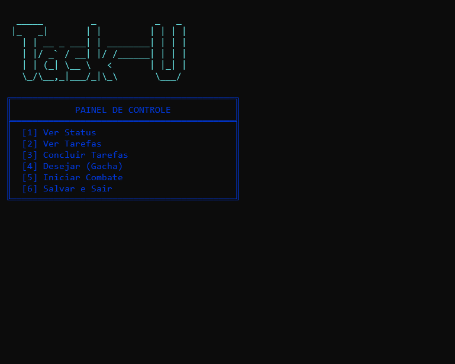
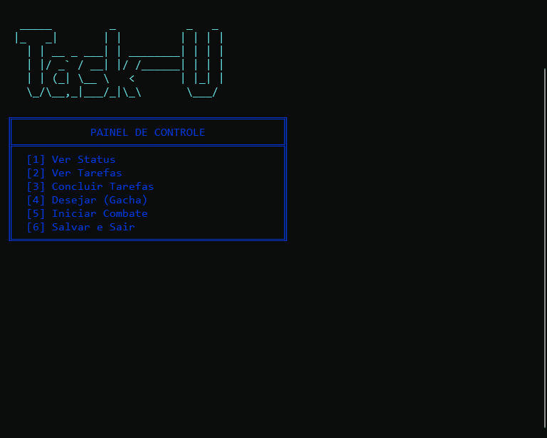
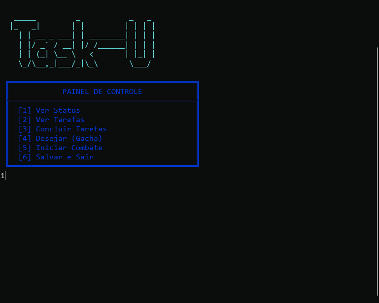
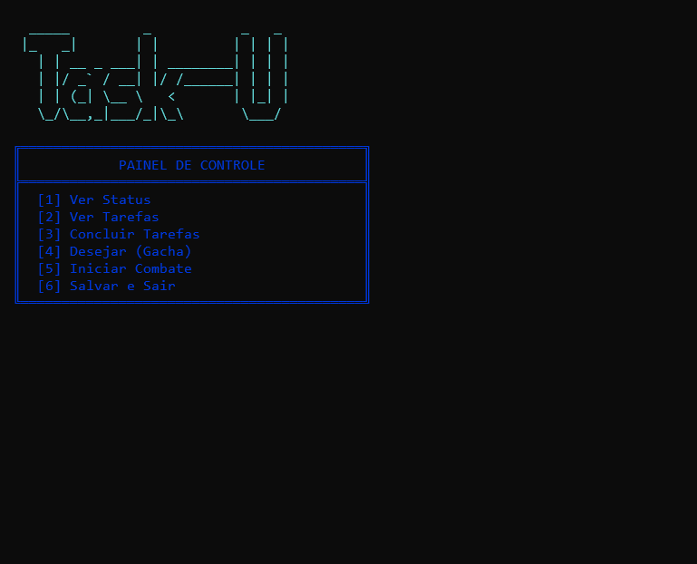

# Task-u


**Task-u** é um RPG de console (*CLI RPG*) desenvolvido em C# com .NET 10, que aplica mecânicas de gamificação à produtividade. O jogo converte a conclusão de tarefas diárias em progresso dentro de um sistema de RPG, utilizando elementos como gacha, combate por turnos e gerenciamento de inventário.

---

## Sobre o Projeto

O projeto nasceu da ideia de transformar tarefas diárias em algo mais recompensador. Cada tarefa concluída gera Cristais, a moeda do jogo, que podem ser usados no sistema de invocação de personagens (*gacha*). A lógica por trás do gacha inclui:

- **Sistema de Pity:** Contadores internos que garantem a obtenção de personagens de alta raridade após um número definido de tentativas, equilibrando a progressão.
- **Banners Rotativos:** Atualização semanal dos personagens com taxa de aparição aumentada, controlada por lógica de tempo e persistência.
- **Persistência de Estado:** Todo o progresso (inventário, personagens desbloqueados, tarefas concluídas) é armazenado localmente com Entity Framework Core e SQLite.

O projeto demonstra competências em:

- C# e .NET 10
- Entity Framework Core (Code-First, Migrations)
- Programação Orientada a Objetos (herança, polimorfismo, encapsulamento)
- Lógica de jogos (combate por turnos, sistema de probabilidade)
- Arquitetura em camadas (separação entre dados, serviços e apresentação)

---

## Funcionalidades

- **Tarefas:** Geração diária de tarefas principais e side quests; conclusão concede Cristais e pode ativar eventos de sorte.
- **Gacha:** Sistema com raridades (Comum, Raro, Épico, Lendário), pity (soft/hard) e banners rotativos.
- **Combate:** Batalhas por turnos contra inimigos gerados dinamicamente, com habilidades especiais, status (stun, silêncio) e uso de itens consumíveis.
- **Inventário:** Gerenciamento de personagens e itens, com dois slots de equipamento que afetam atributos de combate.
- **Persistência:** Dados salvos em SQLite via EF Core, garantindo continuidade entre sessões.

---

## Como Executar

### Pré-requisitos

- [.NET 10 SDK](https://dotnet.microsoft.com/download/dotnet/10.0)
- Entity Framework 
> (Nota: Caso não tenha a ferramenta instalada, execute: dotnet tool install --global dotnet-ef)
- Git (opcional)

### Passos

1. Clone o repositório:
   ```bash
   git clone https://github.com/rallantro/Task-U.git
   cd Task-U
   ```

2. Restaure as dependências e compile:
   ```bash
   dotnet restore
   dotnet build
   ```

3. Aplique as migrações do banco de dados:
   ```bash
   dotnet ef database update
   ```

4. Execute o jogo:
   ```bash
   dotnet run
   ```

## Execução Rápida

Se preferir não configurar o ambiente de desenvolvimento, você pode baixar a versão compilada do jogo na seção **Releases** do repositório.

[Baixar Task-U v1.0.0](https://github.com/rallantro/Task-U/releases/latest)

| Plataforma | Instruções |
|------------|------------|
| Windows | Extraia o arquivo `.zip` e execute `Task-U.exe`. |
| Linux | Extraia o arquivo `.zip`, conceda permissão de execução (`chmod +x Task-U`) e execute `./Task-U`. |

> O banco de dados SQLite (`gacha_database.db`) já está incluso com os dados base para iniciar o jogo imediatamente.
---

## Arquitetura

O Task-u foi estruturado em camadas para separar responsabilidades e facilitar a manutenção. A organização do código reflete a divisão entre lógica de domínio, serviços de negócio, persistência e interface com o usuário.

```
Task-u/
│
├── Core/                           # Lógica central e entidades de domínio
│   ├── PersonagemBase.cs           # Classe base dos personagens
│   ├── InimigoBase.cs              # Classe base dos inimigos
│   ├── Item.cs                     # Modelo de item (usado também em Models)
│   ├── PersonagemInventario.cs     # Relação usuário-personagem
│   ├── ItemInventario.cs           # Relação usuário-item
│   ├── Combat/                     # Módulo de combate
│   │   ├── CombateEngine.cs        # Orquestração da batalha
│   │   ├── CombateUI.cs            # Interface do combate
│   │   ├── TurnoJogador.cs         # Lógica do turno do jogador
│   │   └── TurnoInimigo.cs         # Lógica do turno do inimigo
│   ├── Entities/                   # Personagens específicos (heróis)
│   │   ├── Apostador.cs
│   │   ├── Barbaro.cs
│   │   └── ...
│   └── Enemies/                    # Inimigos específicos
│       ├── Banshee.cs
│       ├── Fada.cs
│       └── ...
│
├── Models/                         # Entidades de persistência (EF Core)
│   ├── User.cs                     # Dados do jogador
│   ├── Tarefa.cs                   # Tarefas ativas do dia
│   ├── BaseTarefas.cs              # Modelo de tarefas diárias
│   ├── SideQuest.cs                # Missões secundárias
│   ├── Banner.cs                   # Banner semanal
│   └── ...
│
├── Data/                           # Contexto do EF Core
│   └── AppDbContext.cs             # DbContext e configurações
│
├── Services/                       # Lógica de negócio
│   ├── TarefaService.cs            # Regeneração e conclusão de tarefas
│   ├── GachaService.cs             # Sorteios e pity
│   ├── BannerService.cs            # Rotação e rate-up
│   ├── InventarioServices.cs       # Gerenciamento de inventário
│   ├── AdventureService.cs         # Geração de inimigos
│   ├── CombatService.cs            # Fachada para o combate
│   └── CreateService.cs            # (Auxiliar, usado para testes)
│
├── Migrations/                     # Migrações geradas pelo EF Core
│
├── Program.cs                      # Loop principal e menu
├── gacha_database.db               # Banco de dados SQLite (gerado)
├── Task-u.csproj                   # Arquivo do projeto
└── README.md
```

A separação em camadas permite que a lógica de negócio (Services) seja independente da persistência (Data) e das definições de domínio (Core). O combate foi isolado no submódulo `Core/Combat`, facilitando manutenção e correção de bugs.

### Fluxo de Dados

1. **Entrada do usuário** → `Program.cs` captura a opção do menu.
2. **Serviço correspondente** é chamado (ex.: `TarefaService.ConcluirTarefa`).
3. O serviço acessa o `AppDbContext` para recuperar/atualizar dados.
4. A lógica de negócio é executada (ex.: calcular cristais, atualizar pity).
5. As alterações são persistidas via `SaveChanges()`.
6. O resultado é exibido no console.

### Padrões Utilizados

- **Herança e Polimorfismo** – usado extensivamente em `PersonagemBase` e `InimigoBase` para permitir que cada personagem/inimigo tenha habilidades únicas.
- **Fachada (Facade)** – `CombatService` esconde a complexidade do `CombateEngine` e dos turnos.
- **Repositório implícito** – o `DbContext` atua como repositório; nenhuma camada adicional foi criada para manter a simplicidade.
- **Injeção de Dependência manual** – as dependências são passadas via construtor ou instanciadas diretamente, mantendo o projeto acessível para um cenário de console.

### Persistência

O Entity Framework Core em modo Code-First gerencia o esquema do banco de dados. As migrações garantem que a estrutura esteja sempre sincronizada com as classes `Models`. SQLite foi escolhido por ser leve, portátil e não exigir servidor.

### Considerações sobre o Combate

O subsistema de combate foi extraído para `Core/Combat` com as seguintes responsabilidades:
- `CombateEngine` – orquestra o loop de batalha.
- `TurnoJogador` e `TurnoInimigo` – controlam as ações de cada lado.
- `CombateUI` – gerencia toda a saída textual e entrada durante o combate.

---

## Banco de Dados

O Task-u utiliza um banco de dados SQLite local (`gacha_database.db`) gerado automaticamente na primeira execução. A estrutura é gerenciada pelo Entity Framework Core por meio de migrações, mas você pode inspecionar ou adicionar dados manualmente, se desejar.

### Localização do Arquivo

- O arquivo `gacha_database.db` é criado no diretório raiz do projeto.
- Ele contém todas as informações de usuários, inventário, tarefas, side quests, personagens, itens e inimigos base. Se desejar criar mais fica a seu dispor. 

### Ferramentas Recomendadas

- **DB Browser for SQLite** – Interface gráfica gratuita para visualizar e editar o banco.
- **SQLite CLI** – Linha de comando (`sqlite3 gacha_database.db`).

### Principais Tabelas e Seus Papéis

| Tabela           | Descrição |
|------------------|-----------|
| `Users`          | Dados do jogador: cristais, pity, equipamentos, inimigo atual. |
| `BaseTarefas`    | Modelo de tarefas que serão geradas diariamente. |
| `SideQuests`     | Missões secundárias que aparecem aleatoriamente a cada dia. |
| `Tarefas`        | Tarefas ativas do dia (criadas a partir das tabelas acima). |
| `Personagens`    | Todos os personagens disponíveis no jogo (heróis). |
| `Itens`          | Itens consumíveis e equipáveis. |
| `Inimigos`       | Inimigos que podem ser enfrentados. |

### Como Adicionar Novas Tarefas ou Side Quests

Para incluir novas tarefas diárias ou side quests, você pode inserir registros diretamente nas tabelas `BaseTarefas` e `SideQuests`. Exemplo de inserção via SQL:

```sql
-- Inserir uma nova tarefa diária (DiaSemana: 0 = Domingo, 1 = Segunda, ..., 6 = Sábado)
INSERT INTO BaseTarefas (DiaSemana, Name, Desc, Dif, IsDone)
VALUES (1, 'Estudar SQL', 'Revise os fundamentos de SQL por 30 minutos.', 2, 0);

-- Inserir uma nova side quest
INSERT INTO SideQuests (Name, Desc, Dif, IsDone)
VALUES ('Meditar', 'Faça 10 minutos de meditação.', 1, 0);
```

> **Nota:** Após adicionar novos registros, o jogo os utilizará automaticamente na próxima regeneração diária de tarefas (quando `lastLogin` for atualizado). Não é necessário recriar o banco.

### Observações sobre os Dados Existentes

- O banco já contém um usuário padrão com ID = 1, alguns personagens, itens e inimigos.
- Se você desejar reiniciar o progresso, basta excluir o arquivo `gacha_database.db` e executar `dotnet ef database update` novamente. Isso criará um novo banco com os dados iniciais definidos nas migrações e nos seeders (se houver).
- A quantidade de cristais dada por tarefa é equivalente a dificuldade da tarefa vezes 2.

---

## Sistema de Tarefas

O Task-u tem como objetivo incentivar a produtividade através de tarefas diárias e side quests que regeneram automaticamente a cada novo dia. O sistema é composto por:

- **Tarefas Principais**: geradas diariamente a partir de uma base fixa (`BaseTarefas`), cada uma associada a um dia da semana.
- **Side Quests**: missões secundárias sorteadas aleatoriamente a cada dia, com dificuldade variável.

### Regeneração Diária

Ao realizar o primeiro login após a meia-noite, o jogo:
1. Limpa as tarefas do dia anterior.
2. Seleciona as tarefas principais correspondentes ao dia atual.
3. Adiciona de 2 a 4 side quests aleatórias.
4. Atualiza o campo `lastLogin` do usuário para a data atual.

### Conclusão e Recompensas

Cada tarefa possui um valor de dificuldade (`Dif`). Ao ser concluída, o jogador recebe Cristais de acordo com a fórmula:

- **Tarefas comuns**: `Cristais = Dif × 2`
- **Tarefas épicas (Dif ≥ 6)**: `Cristais = Dif × 3` e, além disso, ativa um **Evento de Sorte**, que dobra a chance de obter um personagem Lendário no próximo pull.

As tarefas concluídas são marcadas como `IsDone = true` e permanecem visíveis na lista de concluídas.

### Estrutura no Banco

- `BaseTarefas`: modelo das tarefas principais, contendo nome, descrição, dificuldade e o dia da semana.
- `SideQuests`: modelo das missões secundárias.
- `Tarefas`: instâncias ativas do dia, geradas a partir das tabelas acima.

### Demonstração de Tarefa



---

## Sistema de Gacha: Pity, Banner e Raridades

O sistema de invocação (*gacha*) do Task-u é baseado em probabilidades com mecanismos de garantia (*pity*) para equilibrar a experiência do jogador. 

### Raridades e Probabilidades Base

| Raridade | Nome (Código) | Probabilidade Base |
|----------|---------------|-------------------|
| 1        | Comum (C)     | 75% (números 1–750) |
| 2        | Raro (R)      | 15% (números 751–900) |
| 3        | Épico (SR)    | 9% (números 901–990) |
| 4        | Lendário (SSR)| 1% (números 991–1000) |

Os sorteios são realizados por um gerador de números aleatórios que define um valor entre 1 e 1000. A raridade obtida é determinada por faixas fixas, exceto nos casos garantidos pelo sistema de *pity*.

Os pulls Comuns (C) e Raros (R) dão ao jogador um item de equivalente raridade, já os pulls Épicos (SR) e Lendários (SRR) dão ao jogador um personagem.

### Pity

O pity é um contador que assegura a obtenção de itens de alta raridade após um número determinado de tentativas sem sucesso. Existem dois pitys independentes:

- **Pity Épico (maxPityEpic = 10):**  
  Se o jogador realizar 10 pulls consecutivos sem obter um personagem Épico (SR) ou Lendário (SSR), o décimo pull será garantidamente um Épico (ou Lendário, caso o pity de Lendário também seja acionado).

- **Pity Lendário (maxPityLeg = 100):**  
  Se o jogador realizar 100 pulls consecutivos sem obter um Lendário, o centésimo pull será garantidamente um Lendário.  
  **Soft Pity:** A partir do 75º pull sem Lendário, a chance de obtê-lo aumenta progressivamente:  
  - 75º pull: 10% + (5 * 1) = 15%  
  - 76º pull: 10% + (5 * 2) = 20%  
  - ...  
  - 99º pull: 10% + (5 * 25) = 135% (efetivamente garantido antes do hard pity).

### Evento de Sorte (Luck Event)

Ao concluir uma tarefa épica (dificuldade ≥ 6), o jogador ativa um evento de sorte que dobra a chance de obter um personagem Lendário no próximo pull. Esse efeito é consumido no primeiro pull após a ativação.

### Banner Rotativo

O banner semanal determina quais personagens têm **rate-up** (chance aumentada) dentro de suas respectivas raridades.

- A cada 7 dias (baseado no campo `LastBannerUpdate` do usuário), o banner é atualizado:
  - Um personagem Épico e um Lendário são selecionados aleatoriamente entre os disponíveis.
  - Esses personagens são salvos na tabela `Banner`.

- Durante o sorteio:
  - Quando um pull resulta em **Épico (SR)**, há 50% de chance de ser o personagem rate-up (vs. 50% para qualquer outro Épico).
  - Quando um pull resulta em **Lendário (SSR)**, há 50% de chance de ser o personagem rate-up (vs. 50% para qualquer outro Lendário).

Essa lógica foi feita para incentivar o usuário a guardar seus cristais, realizando mais tarefas, para conseguir o personagem que deseja quando ele estiver em **rate-up**. Além disso, também cria um maior dinamismo ao longo do tempo.

### Fluxo de um Pull

Quando o usuário realiza um *desejo*, o `gachaService` realiza o seguinte fluxo:

1. Ele verifica se o pity Lendário atingiu o soft pity ou o hard pity para ajustar a chance.
2. Gera um número aleatório e compara com a chance ajustada.
3. Se for Lendário: chama `BannerService.LegendPull()` – que decide se será rate-up (50%) ou aleatório.
4. Se for Épico: chama `BannerService.EpicPull()` – mesma lógica de rate-up, porém para um personagem épico.
5. Se for Raro ou Comum: obtém um item correspondente das tabelas `Itens`.
6. Por fim, atualiza pitys, adiciona o item/personagem ao inventário, decrementa cristais e persiste no banco.

### Demonstração de Pull:



### Demonstração de Pull SSR:


### Observações Técnicas

- Os pitys são armazenados por usuário (`User.PityLeg` e `User.PityEpic`) e são resetados quando um pull da raridade correspondente é obtido.
- O cálculo de soft pity é dinâmico: `chance = legChance + (5 * (pityLeg - 74))` para pityLeg ≥ 75.
- O banner é recalculado apenas quando a data da última atualização ultrapassa 7 dias, garantindo que o mesmo banner permaneça ativo durante a semana.
- O sistema utiliza `EF.Functions.Random()` no banco para selecionar itens/personagens aleatórios quando o rate-up não é escolhido.

## Inventário e Itens

O sistema de inventário do Task-u gerencia dois tipos de recursos: **personagens** e **itens**. Ambos são armazenados no banco de dados e podem ser visualizados ou equipados através do menu principal.

### Personagens

Os personagens obtidos no gacha são adicionados ao inventário do jogador. Eles podem ser equipados em dois slots de equipe (Slot 1 e Slot 2), que determinam quem participa dos combates. Apenas personagens equipados podem ser usados em batalha.

- **Equipamento:** Através do menu `1 - Ver Status > 1 - Ver Personagens > 2 - Trocar Personagem Ativo`, é possível selecionar um personagem disponível para ocupar um dos slots.  
- **Duplicatas:** Personagens repetidos são armazenados como cópias adicionais. (No futuro, planeja-se fazer um sistema de ascensão ou melhoria nos personagens com base nas cópias adicionais.)

#### Personagens Disponíveis

O jogo conta atualmente com **12 personagens** distribuídos entre as raridades Épico (SR) e Lendário (SSR). Cada personagem possui habilidades únicas, passivas e estilos de combate distintos, que incentivam diferentes estratégias durante as batalhas.

Para descrições detalhadas, citações de invocação e mecânicas específicas, consulte o arquivo:  **[PERSONAGENS.md](./docs/PERSONAGENS.md)**

### Itens

Os itens são divididos em duas categorias principais, definidas pelo campo `Type` na tabela `Itens`:

| Tipo | Descrição |
|------|-----------|
| **Consumível (1)** | Utilizados durante o combate para gerar um efeito imediato e são removidos do inventário após o uso. Ex.: poções de cura, buffs temporários. |
| **Modificador (2)** | Equipáveis nos slots de item (Slot 1 e Slot 2). Concedem bônus permanentes aos atributos do personagem enquanto estiverem equipados. |

#### Atributos dos Itens

Cada item possui um `Atr` que define qual estatística ele afeta:

| Atr | Efeito |
|-----|--------|
| 1 (HP) | Restaura ou aumenta pontos de vida (consumíveis) |
| 2 (Atk) | Aumenta o dano causado (equipáveis) |
| 3 (Mod) | Aumenta o modificador de habilidades (equipáveis ou consumíveis) |

O valor do bônus é definido pelo campo `Mod` do item.

### Uso em Combate

- **Itens consumíveis:** Durante o turno de um personagem, o jogador pode optar por usar um item. Uma lista de itens consumíveis disponíveis é exibida; ao selecionar um, o efeito é aplicado imediatamente (ex.: cura de HP) e o item é removido do inventário.  
- **Itens equipáveis:** São equipados no menu principal e seus efeitos são calculados automaticamente em cada ação do personagem (dano, cura, etc.). A fórmula de `AtkTotal()` e `ModTotal()` já considera os bônus dos itens equipados.

### Gerenciamento no Menu

- **Ver Inventário:** Acessado via `1 - Ver Status`. Permite visualizar todos os personagens e itens obtidos, incluindo quantidades.  
- **Trocar Equipamentos:** Através da opção de inventário, é possível equipar personagens nos slots de equipe e itens nos slots de item. O sistema impede que o mesmo personagem seja equipado em ambos os slots simultaneamente.

### Persistência

Todas as informações de inventário são mantidas em duas tabelas de junção:

- `InventarioPersonagens` – relaciona `User` com `PersonagemBase` (quantidade implícita pela contagem de registros).  
- `InventarioItens` – relaciona `User` com `Item`, também usando contagem de registros para duplicatas.

Essa estrutura permite consultas eficientes e mantém a integridade referencial com o Entity Framework Core.

### Demonstração do Inventário



---

## Sistema de Combate

O combate é estruturado como um RPG de turnos alternados, onde o jogador controla até dois personagens contra um inimigo gerado dinamicamente. 

### Fluxo Básico

1. **Inicialização** – O inimigo é apresentado e os personagens da equipe são preparados (HP restaurado, aliados definidos).
2. **Turno do Jogador** – Cada personagem pode realizar uma ação por turno: ataque básico, habilidade especial ou usar um item. Ações podem ser bloqueadas por efeitos de stun ou silêncio.
3. **Turno do Inimigo** – O inimigo executa sua passiva, habilidade (se disponível) e um ataque direcionado a um alvo com base em pesos de agressividade.
4. **Fim do Combate** – A batalha termina quando a equipe ou o inimigo chega a 0 HP. Vitórias concedem cristais e, ocasionalmente, itens.

### Mecânicas Principais

- **Status**: Stun (perde turno), Silence (impede habilidades), Shield (absorve dano), Buffs temporários.
- **Passivas e Habilidades**: Cada personagem (herói e inimigo) possui habilidades únicas que alteram o fluxo do combate. Além disso, cada personagem e inimigo possui uma passiva única, que é utilizada no início de cada turno próprio. 
- **Alvos**: O inimigo escolhe alvos com base em `chanceAlvo` (peso que pode ser modificado por habilidades). O jogador sempre ataca o inimigo, mas habilidades de suporte podem mirar aliados.

Para uma descrição detalhada de todas as mecânicas, classes envolvidas e lógica de geração de inimigos, consulte: **[COMBATE.md](./docs/COMBATE.md)**

### Demonstração de Combate



---

## Geração de Inimigos

O inimigo enfrentado pelo jogador é determinado dinamicamente pelo `AdventureService`, que define sua raridade e identidade com base em duas situações: **regeneração diária** ou **evolução pós-derrota**.

### Regeneração Diária

Todos os dias, ao realizar o primeiro login após a meia-noite, um novo inimigo é gerado. A raridade é sorteada com as seguintes probabilidades:

| Raridade | Chance |
|----------|--------|
| Comum (1) | 50%    |
| Raro (2)  | 30%    |
| Épico (3) | 16%    |
| Lendário (4)| 4%    |

Após definir a raridade, um inimigo específico daquela classe é selecionado aleatoriamente entre os disponíveis no banco de dados e atribuído ao campo `User.InimigoId`.

### Evolução Pós-Derrota

Quando o jogador derrota um inimigo (sinalizado por `User.DerrotouInimigo = true`), o próximo inimigo gerado segue uma lógica de **progressão de dificuldade**:

- Se o inimigo derrotado tinha raridade **1 (Comum) ou 2 (Raro)**, o novo inimigo terá raridade aumentada em 0 ou 1 (50% de chance para cada).
- Se o inimigo derrotado tinha raridade **3 (Épico)**, o novo inimigo tem 10% de chance de evoluir para Lendário (raridade 4) e 90% de chance de permanecer Épico.
- Se o inimigo derrotado era **Lendário (4)**, a raridade é reiniciada para Comum (raridade 1).

Em todos os casos, o novo inimigo é sorteado aleatoriamente dentro da raridade resultante.

### Persistência

O inimigo atual do jogador é armazenado no campo `InimigoId` da tabela `Users`, e o estado de derrota é controlado por `DerrotouInimigo`. Ambos são atualizados automaticamente ao final de cada combate vitorioso ou no início de um novo dia.

---

## Contribuições

Este projeto é um trabalho pessoal voltado para estudo e portfólio. Feedbacks, sugestões e contribuições são bem-vindos.

### Como contribuir

- **Bugs e melhorias:** Caso encontre algum erro ou tenha uma ideia de refatoração, fique à vontade para abrir uma *Issue* ou enviar um *Pull Request*. Todos os PRs passarão por revisão antes do merge.
- **Novos personagens:** Se tiver uma sugestão de herói, habilidade ou passiva, abra uma *Issue* com a tag `suggestion` utilizando o modelo abaixo:
  - Nome
  - Raridade
  - Habilidades e Passivas
  - Frase de Invocação
  - Atributos base (ATK, HP, Mod)

### Sugerindo um personagem

Caso queira sugerir um personagem, pode seguir o formato utilizado em `PERSONAGENS.md`. Ficarei feliz em avaliar ideias que possam expandir o universo do Task-u.

---

## Desenvolvimento Futuro

- **Ascensão de Personagens:** Cópias repetidas de um mesmo personagem concederão bônus de atributos ou habilidades.
- **Expansão do Sistema de Itens:** Implementar itens consumíveis com efeitos variados (buff de ataque, escudo temporário, remoção de status) e ampliar os tipos de itens equipáveis.
- **Expansão de Conteúdo:** Novos inimigos e personagens com mecânicas distintas.
- **Interface Melhorada:** Possível migração para uma interface gráfica simples (Windows Forms ou Terminal.Gui).

---

### Limitações Conhecidas

- **Itens Consumíveis:** Atualmente, apenas itens de cura e buff temporário de modificador estão implementados. Suporte para outros efeitos (buff de ataque, escudo, etc.) está planejado para versões futuras.
- **Usuário Único:** O jogo foi desenvolvido com um único usuário fixo (ID = 1) para simplificar a lógica. Uma versão futura poderá implementar múltiplos perfis.

---

## Licença

Este projeto está licenciado sob a **MIT License** – consulte o arquivo [LICENSE](LICENSE) para mais detalhes.

A licença MIT é uma licença permissiva e de código aberto que permite que qualquer pessoa utilize, copie, modifique, distribua e até mesmo utilize o código em projetos comerciais, desde que mantenham os créditos originais (aviso de copyright e a própria licença).

> **Nota:** Este projeto foi desenvolvido para fins educacionais e de portfólio. O código é fornecido "como está", sem garantias de qualquer tipo.

---

## Autor

**Ronaldo Allan**  
Desenvolvedor Júnior | C# / .NET | APIs REST & SQL | Full Stack

[](https://www.linkedin.com/in/ronaldovrocha/)  [](https://github.com/rallantro/)

