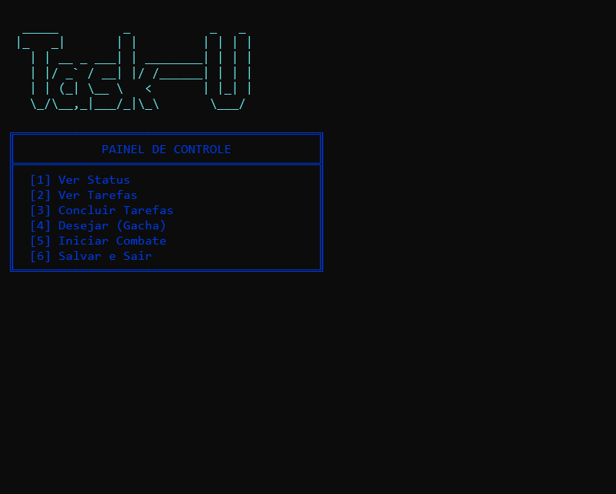
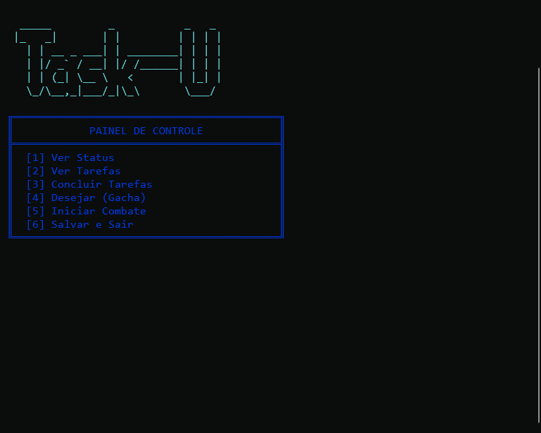
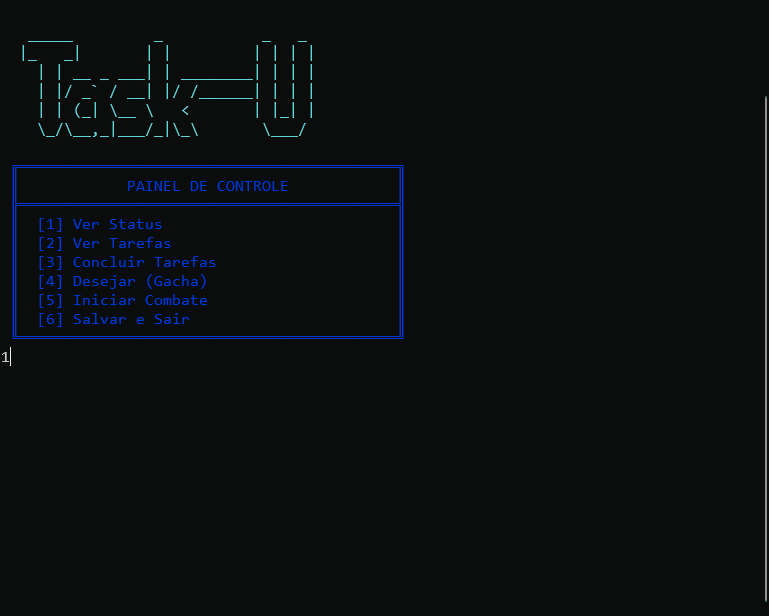
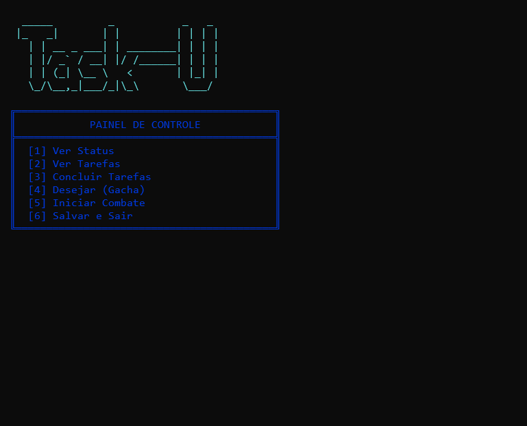

# Task-u


**Task-u** é um RPG de console (*CLI RPG*) desenvolvido em C# com .NET 10, que aplica mecânicas de gamificação à produtividade. O jogo converte a conclusão de tarefas diárias em progresso dentro de um sistema de RPG, utilizando elementos como gacha, combate por turnos e gerenciamento de inventário.

---

## Sobre o Projeto

O projeto nasceu da ideia de transformar tarefas diárias em algo mais recompensador. Cada tarefa concluída gera Cristais, a moeda do jogo, que podem ser usados no sistema de invocação de personagens (*gacha*). A lógica por trás do gacha inclui:

- **Sistema de Pity:** Contadores internos que garantem a obtenção de personagens de alta raridade após um número definido de tentativas, equilibrando a progressão.
- **Banners Rotativos:** Atualização semanal dos personagens com taxa de aparição aumentada, controlada por lógica de tempo e persistência.
- **Persistência de Estado:** Todo o progresso (inventário, personagens desbloqueados, tarefas concluídas) é armazenado localmente com Entity Framework Core e SQLite.

O projeto demonstra competências em:

- C# e .NET 10
- Entity Framework Core (Code-First, Migrations)
- Programação Orientada a Objetos (herança, polimorfismo, encapsulamento)
- Lógica de jogos (combate por turnos, sistema de probabilidade)
- Arquitetura em camadas (separação entre dados, serviços e apresentação)

---

## Funcionalidades

- **Tarefas:** Geração diária de tarefas principais e side quests; conclusão concede Cristais e pode ativar eventos de sorte.
- **Gacha:** Sistema com raridades (Comum, Raro, Épico, Lendário), pity (soft/hard) e banners rotativos.
- **Combate:** Batalhas por turnos contra inimigos gerados dinamicamente, com habilidades especiais, efeitos de estado e uso de itens consumíveis.
- **Inventário:** Gerenciamento de personagens e itens, com dois slots de equipamento que afetam atributos de combate.
- **Persistência:** Dados salvos em SQLite via EF Core, garantindo continuidade entre sessões.

---

## Como Executar

## Execução Rápida

Se preferir não configurar o ambiente de desenvolvimento, você pode baixar a versão compilada do jogo na seção **Releases** do repositório.

[Baixar Task-U v1.4.8](https://github.com/rallantro/Task-U/releases/latest)

| Plataforma | Instruções |
|------------|------------|
| Windows | Extraia o arquivo `.zip` e execute `Task-U.exe`. |
| Linux | Extraia o arquivo `.zip`, conceda permissão de execução (`chmod +x Task-U`) e execute `./Task-U`. |

> O banco de dados SQLite (`gacha_database.db`) já está incluso com os dados base para iniciar o jogo imediatamente.

### Pré-requisitos

- [.NET 10 SDK](https://dotnet.microsoft.com/download/dotnet/10.0)
- Entity Framework 
> (Nota: Caso não tenha a ferramenta instalada, execute: dotnet tool install --global dotnet-ef)
- Git (opcional)

### Passos

1. Clone o repositório:
   ```bash
   git clone https://github.com/rallantro/Task-U.git
   cd Task-U
   ```

2. Restaure as dependências e compile:
   ```bash
   dotnet restore
   dotnet build
   ```

3. Aplique as migrações do banco de dados:
   ```bash
   dotnet ef database update
   ```

4. Execute o jogo:
   ```bash
   dotnet run
   ```
---

## Arquitetura

O Task-u foi estruturado em camadas para separar responsabilidades e facilitar a manutenção. A organização do código reflete a divisão entre lógica de domínio, serviços de negócio, persistência e interface com o usuário.

```
Task-U/
├── Core/                            # Lógica central e entidades de domínio
│   ├── Combat/                      # Módulo e fluxo de combate
│   │   ├── CombateEngine.cs         # Orquestração principal da batalha
│   │   ├── CombateUI.cs             # Interface de usuário do combate
│   │   ├── TurnoJogador.cs          # Lógica das ações do jogador
│   │   └── TurnoInimigo.cs          # IA e ações dos inimigos
│   ├── Entities/                    # Heróis/Personagens jogáveis (Apostador, Bárbaro, etc.)
│   ├── Enemies/                     # Inimigos do jogo (Aranha, Banshee, Oni, etc.)
│   ├── Itens/                       # Definição e comportamentos de itens
│   │   ├── Boss/                    # Recompensas de chefes
│   │   └── Loja/                    # Itens compráveis
│   ├── StatusEffects/               # Sistema de efeitos de status (Buffs/Debuffs)
│   │   ├── Status/                  # Efeitos específicos (Poison, Stun, Silence, etc.)
│   │   └── StatusEffect.cs          # Classe base para status
│   ├── PersonagemBase.cs            # Classe base dos sigilos
│   ├── InimigoBase.cs               # Classe base dos inimigos
│   ├── Item.cs                      # Modelo base de item
│   ├── PersonagemInventario.cs      # Relacionamento de personagens do usuário
│   └── ItemInventario.cs            # Relacionamento do inventário de itens
│
├── Models/                          # Entidades de persistência do EF Core
│   ├── User.cs                      # Dados e perfil do jogador
│   ├── Tarefa.cs / BaseTarefas.cs   # Tarefas ativas e diárias
│   ├── SideQuest.cs                 # Missões secundárias
│   ├── Banner.cs                    # Banners do sistema Gacha
│   ├── Loja.cs                      # Estado da loja de itens
│   └── Config.cs                    # Configurações do sistema
│
├── Services/                        # Lógica de negócio da aplicação
│   ├── TarefaService.cs             # Gerenciamento e conclusão de tarefas
│   ├── GachaService.cs              # Sistema de invocações e pity
│   ├── BannerService.cs             # Rotações de banners
│   ├── CombatService.cs             # Fachada para o loop de combate
│   ├── AdventureService.cs          # Geração de encontros e inimigos
│   ├── InventarioServices.cs        # Gestão do inventário
│   ├── LojaService.cs               # Sistema de compras
│   ├── UpdateService.cs             # Atualizações de estado do sistema
│   └── CreateService.cs             # Serviço auxiliar
│
├── Data/                            # Camada de banco de dados
│   └── AppDbContext.cs              # Mapeamento e contexto do EF Core
│
├── Migrations/                      # Histórico de migrações do EF Core
│   └── ...                          # (Arquivos de migração do banco)
│
├── docs/                            # Documentação e assets do projeto
│   ├── COMBATE.md                   # Regras e mecânicas de combate
│   ├── PERSONAGENS.md               # Detalhes e atributos das entidades
│   └── img/                         # GIFs e imagens demonstrativas
│
├── Program.cs                       # Ponto de entrada e menu principal
├── gacha_database.db                # Banco de dados SQLite
├── Task-U.csproj                    # Configuração do projeto .NET
├── Task-U.sln                       # Arquivo de solução
├── README.md                        # Documentação principal
├── LICENSE                          # Licença do repositório
├── icone.ico                        # Ícone da aplicação
└── .gitignore                       # Filtros de arquivos para o Git
```

A separação em camadas permite que a lógica de negócio (Services) seja independente da persistência (Data) e das definições de domínio (Core). O combate foi isolado no submódulo `Core/Combat`, facilitando manutenção e correção de bugs.

### Fluxo de Dados

1. **Entrada do usuário** → `Program.cs` captura a opção do menu.
2. **Serviço correspondente** é chamado (ex.: `TarefaService.ConcluirTarefa`).
3. O serviço acessa o `AppDbContext` para recuperar/atualizar dados.
4. A lógica de negócio é executada (ex.: calcular cristais, atualizar pity).
5. As alterações são persistidas via `SaveChanges()`.
6. O resultado é exibido no console.

### Padrões Utilizados

- **Herança e Polimorfismo** – usado extensivamente em `PersonagemBase` e `InimigoBase` para permitir que cada personagem/inimigo tenha habilidades únicas.
- **Fachada (Facade)** – `CombatService` esconde a complexidade do `CombateEngine` e dos turnos.
- **Repositório implícito** – o `DbContext` atua como repositório; nenhuma camada adicional foi criada para manter a simplicidade.
- **Injeção de Dependência manual** – as dependências são passadas via construtor ou instanciadas diretamente, mantendo o projeto acessível para um cenário de console.

### Persistência

O Entity Framework Core em modo Code-First gerencia o esquema do banco de dados. As migrações garantem que a estrutura esteja sempre sincronizada com as classes `Models`. SQLite foi escolhido por ser leve, portátil e não exigir servidor.

### Considerações sobre o Combate

O subsistema de combate foi extraído para `Core/Combat` com as seguintes responsabilidades:
- `CombateEngine` – orquestra o loop de batalha.
- `TurnoJogador` e `TurnoInimigo` – controlam as ações de cada lado.
- `CombateUI` – gerencia toda a saída textual e entrada durante o combate.

---

## Banco de Dados

O Task-u utiliza um banco de dados SQLite local (`gacha_database.db`) gerado automaticamente na primeira execução. A estrutura é gerenciada pelo Entity Framework Core por meio de migrações, mas você pode inspecionar ou adicionar dados manualmente, se desejar.

### Localização do Arquivo

- O arquivo `gacha_database.db` é criado no diretório raiz do projeto.
- Ele contém todas as informações de usuários, inventário, tarefas, side quests, personagens, itens e inimigos base. Se desejar criar mais fica a seu dispor. 

### Ferramentas Recomendadas

- **DB Browser for SQLite** – Interface gráfica gratuita para visualizar e editar o banco.
- **SQLite CLI** – Linha de comando (`sqlite3 gacha_database.db`).

### Principais Tabelas e Seus Papéis

| Tabela           | Descrição |
|------------------|-----------|
| `Users`          | Dados do jogador: cristais, pity, equipamentos, inimigo atual. |
| `BaseTarefas`    | Modelo de tarefas que serão geradas diariamente. |
| `SideQuests`     | Missões secundárias que aparecem aleatoriamente a cada dia. |
| `Tarefas`        | Tarefas ativas do dia (criadas a partir das tabelas acima). |
| `Personagens`    | Todos os personagens disponíveis no jogo (sigilos). |
| `Itens`          | Itens consumíveis e equipáveis. |
| `Inimigos`       | Inimigos que podem ser enfrentados. |

### Como Adicionar Novas Tarefas ou Side Quests

Para incluir novas tarefas diárias ou side quests, você pode inserir registros diretamente nas tabelas `BaseTarefas` e `SideQuests`. Exemplo de inserção via SQL:

```sql
-- Inserir uma nova tarefa diária (DiaSemana: 0 = Domingo, 1 = Segunda, ..., 6 = Sábado)
INSERT INTO BaseTarefas (DiaSemana, Name, Desc, Dif, IsDone)
VALUES (1, 'Estudar SQL', 'Revise os fundamentos de SQL por 30 minutos.', 2, 0);

-- Inserir uma nova side quest
INSERT INTO SideQuests (Name, Desc, Dif, IsDone)
VALUES ('Meditar', 'Faça 10 minutos de meditação.', 1, 0);
```

> **Nota:** Após adicionar novos registros, o jogo os utilizará automaticamente na próxima regeneração diária de tarefas (quando `lastLogin` for atualizado). Não é necessário recriar o banco.

### Observações sobre os Dados Existentes

- O banco já contém um usuário padrão com ID = 1, alguns personagens, itens e inimigos.
- Se você desejar reiniciar o progresso, basta excluir o arquivo `gacha_database.db` e executar `dotnet ef database update` novamente. Isso criará um novo banco com os dados iniciais definidos nas migrações e nos seeders (se houver).
- A quantidade de cristais dada por tarefa é equivalente a dificuldade da tarefa vezes 2. Ou 3, em casos especiais.

---

## Serviço de Atualização (UpdateService)

### Visão Geral

O `UpdateService` é responsável por verificar a versão atual do jogo armazenada no banco de dados e, se necessário, aplicar uma sequência de patches para atualizar o banco e a configuração para a versão mais recente. Isso garante que a estrutura de dados, novos conteúdos e correções sejam aplicados de forma controlada e progressiva, mesmo que o usuário esteja saltando várias versões.

O serviço é invocado durante a inicialização do jogo, antes de qualquer outra operação, para assegurar que o banco esteja consistente com a versão do código em execução.

---

### Componentes Principais

| Classe / Método | Responsabilidade |
|----------------|------------------|
| `UpdateService` | Contém a lógica de verificação e aplicação de patches. |
| `Verify()`     | Método público que compara a versão atual do banco com a versão esperada e dispara a atualização se necessário. |
| `UpdateVersion()` | Método privado que orquestra a aplicação sequencial dos patches entre a versão antiga e a nova. |
| `supportVersions` | Lista de patches disponíveis, cada um com nome, versão e uma ação (`Action<AppDbContext>`) que executa as alterações necessárias. |
| `Config` (tabela) | Armazena no banco a versão atual (campo `Value`) e o nome da versão (`Name`). |

---

## Fluxo de Atualização

1. **Inicialização**  
   O jogo chama `UpdateService.Verify(context, ActualVersion)`, onde `ActualVersion` é a versão do código em execução (definida em uma constante, ex.: `"1.4.8"`).

2. **Verificação da Versão Atual**  
   - Tenta buscar o registro `Config` com `Id = 1` no banco.  
   - Se não existir, cria um novo registro com a versão base (`"1.4.8"`) e o nome `"Os Tempos Caídos"`.

3. **Comparação**  
   - Compara a `Value` do registro encontrado com a `Value` da versão atual (`ActualVersion`).  
   - Se forem iguais, nada é feito.  
   - Se diferentes, chama `UpdateVersion()` para aplicar os patches.

4. **Aplicação de Patches**  
   - Obtém a versão antiga (do banco) e a versão alvo (atual).  
   - Localiza a posição da versão antiga na lista `supportVersions`.  
   - Se a versão antiga não estiver na lista, lança uma exceção informando que a atualização não é suportada (exige reinstalação a partir de uma versão mínima).  
   - Itera sobre os patches a partir da posição seguinte até o final da lista.  
   - Para cada patch:  
     - Exibe uma mensagem no console.  
     - Executa a `Action` associada (que modifica o `DbContext`).  
     - Atualiza o registro `Config` com o novo `Name` e `Value`.  
     - Salva as alterações no banco (`SaveChanges`).  
   - Após todos os patches, exibe uma mensagem de conclusão e aguarda um breve momento antes de continuar.

5. **Pós‑atualização**  
   - O jogo prossegue normalmente com o banco já na versão mais recente.

---

## Estrutura da Lista de Patches

A lista `supportVersions` é uma tupla contendo:

- `name` – Nome descritivo da versão (ex.: `"Os Tempos Caídos"`).  
- `version` – String da versão (ex.: `"1.4.8"`).  
- `action` – Um delegate `Action<AppDbContext>` que contém as alterações SQL/EF Core a serem aplicadas para migrar o banco para aquela versão.

**Exemplo da lista:**

```csharp
List<(string name, string version, Action<AppDbContext>)> supportVersions = new()
{
    ("Os Tempos Caídos", "1.4.8", UpdatePatch_1_4_8),
    // futuros patches serão adicionados aqui, em ordem crescente
};
```

## Sistema de Tarefas

O Task-u tem como objetivo incentivar a produtividade através de tarefas diárias e side quests que regeneram automaticamente a cada novo dia. O sistema é composto por:

- **Tarefas Principais**: geradas diariamente a partir de uma base fixa (`BaseTarefas`), cada uma associada a um dia da semana.
- **Side Quests**: missões secundárias sorteadas aleatoriamente a cada dia, com dificuldade variável.

### Regeneração Diária

Ao realizar o primeiro login após a meia-noite, o jogo:
1. Limpa as tarefas do dia anterior.
2. Seleciona as tarefas principais correspondentes ao dia atual.
3. Adiciona de 2 a 4 side quests aleatórias.
4. Atualiza o campo `lastLogin` do usuário para a data atual.

### Conclusão e Recompensas

Cada tarefa possui um valor de dificuldade (`Dif`). Ao ser concluída, o jogador recebe Cristais de acordo com a fórmula:

- **Tarefas comuns**: `Cristais = Dif × 2`
- **Tarefas épicas (Dif ≥ 6)**: `Cristais = Dif × 3` e, além disso, ativa um **Evento de Sorte**, que dobra a chance de obter um personagem Lendário no próximo pull.

As tarefas concluídas são marcadas como `IsDone = true` e permanecem visíveis na lista de concluídas.

### Estrutura no Banco

- `BaseTarefas`: modelo das tarefas principais, contendo nome, descrição, dificuldade e o dia da semana.
- `SideQuests`: modelo das missões secundárias.
- `Tarefas`: instâncias ativas do dia, geradas a partir das tabelas acima.

### Demonstração de Tarefa



---

## Sistema de Gacha: Pity, Banner e Raridades

O sistema de invocação (*gacha*) do Task-u é baseado em probabilidades com mecanismos de garantia (*pity*) para equilibrar a experiência do jogador. 

---

## Componentes Principais

A lógica de gacha está distribuída em duas classes principais:

| Classe | Responsabilidade |
|--------|------------------|
| `Gacha` | Gerencia o fluxo completo de um pull, incluindo sorteio, animações, pity, obtenção do resultado e persistência. |
| `BannerService` | Mantém o banner semanal ativo (rate‑up), seleciona os personagens em destaque e fornece métodos para sortear personagens épicos/lendários respeitando o rate‑up. |

---

### Raridades e Probabilidades Base

| Raridade | Nome (Código) | Probabilidade Base |
|----------|---------------|-------------------|
| 1        | Comum (C)     | 75% |
| 2        | Raro (R)      | 19% |
| 3        | Épico (SR)    | 5% |
| 4        | Lendário (SSR)| 1% |

Os sorteios são realizados por um gerador de números aleatórios que define um valor entre 1 e 1000. A raridade obtida é determinada por faixas fixas, exceto nos casos garantidos pelo sistema de *pity*.

Os pulls Comuns (C) e Raros (R) dão ao jogador um item de equivalente raridade, já os pulls Épicos (SR) e Lendários (SSR) dão ao jogador um personagem.

### Pity

O pity é um contador que assegura a obtenção de itens de alta raridade após um número determinado de tentativas sem sucesso. Existem dois pitys independentes:

- **Pity Épico (`maxPityEpic = 10`)**  
  Se o jogador realizar 10 pulls consecutivos sem obter um personagem Épico (SR) ou Lendário (SSR), o décimo pull será garantidamente um Épico (a menos que o pity Lendário também seja acionado, o que tem prioridade).  
  Após obter um Épico ou Lendário, este pity é resetado para 0.

- **Pity Lendário (`maxPityLeg = 100`)**  
  Se o jogador realizar 100 pulls consecutivos sem obter um Lendário, o centésimo pull será garantidamente um Lendário.  
  **Soft Pity:** a partir do 75º pull sem Lendário, a chance de obtê-lo aumenta progressivamente:  
  - 75º pull: 10 + (20 * (75 – 74)) = 10 + 20 = 30
  - 76º pull: 10 + (20 * 2) = 50  
  - 77º pull: 10 + (20 * 3) = 70
  - ...  
  - 89º pull: 10 + (20 * 15) = 310 (31% de chance)
  O pity Lendário é resetado para 0 sempre que um Lendário é obtido.

Ambos os pitys são armazenados no usuário (`PityEpic` e `PityLeg`) e são incrementados a cada pull, independentemente do resultado.

### Evento de Sorte (Luck Event)

Ao concluir uma tarefa épica (dificuldade ≥ 6), o jogador ativa um evento de sorte que dobra a chance de obter um personagem Lendário no próximo pull. Esse efeito é consumido no primeiro pull após a ativação.

### Banner Rotativo

O banner semanal determina quais personagens têm **rate-up** (chance aumentada) dentro de suas respectivas raridades.

- A cada 7 dias (baseado no campo `LastBannerUpdate` do usuário), o banner é atualizado:
  - Um personagem Épico e um Lendário são selecionados aleatoriamente entre os disponíveis.
  - Esses personagens são salvos na tabela `Banner`.

- Durante o sorteio:
  - Quando um pull resulta em **Épico (SR)**, há 50% de chance de ser o personagem rate-up (vs. 50% para qualquer outro Épico).
  - Quando um pull resulta em **Lendário (SSR)**, há 50% de chance de ser o personagem rate-up (vs. 50% para qualquer outro Lendário).

Essa lógica foi feita para incentivar o usuário a guardar seus cristais, realizando mais tarefas, para conseguir o personagem que deseja quando ele estiver em **rate-up**. Além disso, também cria um maior dinamismo ao longo do tempo.

### Fluxo de um Pull

Quando o usuário realiza um *desejo*, o `gachaService` realiza o seguinte fluxo, caso o usuário tenha *cristais o suficiente*:

1. **Custo e Incremento dos Pitys**  
   - Decrementa **10 cristais** do usuário.  
   - Incrementa `pityLeg` e `pityEpic` em 1.

2. **Cálculo da Chance Lendária**  
   - Chance base = `legChance` (10).  
   - Se `pityLeg >= 75`, aplica soft pity: `currentChance = 10 + (20 * (pityLeg - 74))`.  
   - Se `luckEvent` estiver ativo, dobra `currentChance` e desativa o evento.

3. **Exibição da Animação de Suspense**  
   - Mostra uma sequência de frames com pontos e círculos, pausando para criar expectativa.

4. **Sorteio**  
   Um número aleatório é gerado (1 a 1000). 

5. **Resultados possíveis:**  

   - **Lendário (SSR):**  
     Se o número for ≤ chance calculada (inicia-se com 1%) **ou** pity Lendário = 100.  
     Você vê uma explosão dourada, ouve uma frase especial do personagem e ganha um sigilo lendário.  
     *Ambos os pitys são zerados.*

   - **Épico (SR):**  
     Se o número for  menor ou igual a 60 **ou** pity Épico = 10.  
     Efeito roxo, frase e um personagem épico.  
     *Apenas o pity Épico é zerado.*

   - **Raro (R):**  
     Se o número for menor ou igual a 250.  
     Você ganha um item raro (não personagem).  
     Sem alteração nos pitys.

   - **Comum (C):**  
     Qualquer número acima de 250.  
     Ganha um item comum.  
     Sem alteração nos pitys.

6. **Personagens repetidos – o sistema de Nodes (Constelações):**  
   Quando você tira um personagem que já possui, acontece o seguinte:

   - Se você tem **menos de 6 cópias** dele, a quantidade aumenta em 1.  
     Isso desbloqueia um **Node** (nível de constelação), que fortalece passivamente o personagem em batalhas futuras.  
     A cada nova cópia, um novo Node é liberado – até o máximo de 6.

   - Se você já tem **6 cópias** (todos os Nodes liberados), a cópia extra é automaticamente **convertida em Bits**:  
     - Lendário → **200 Bits**  
     - Épico → **25 Bits**  
     Bits são uma moeda especial usada na **Loja de Bits**.

7. **Progresso de garantia exibido.**  
   No final, você vê quantos pulls faltam para o próximo pity garantido de cada raridade.

8. **Tudo é salvo.**  
   Os pitys atualizados, os novos itens/personagens no inventário e os Bits (se houver) vão direto para o banco de dados.
### Demonstração de Pull:



### Demonstração de Pull SSR:


### Observações Técnicas

- Os pitys são armazenados por usuário (`User.PityLeg` e `User.PityEpic`) e são resetados quando um pull da raridade correspondente é obtido.
- O cálculo de soft pity é dinâmico: `chance = legChance + (20 * (pityLeg - 74))` para pityLeg ≥ 75.
- O banner é recalculado apenas quando a data da última atualização ultrapassa 7 dias, garantindo que o mesmo banner permaneça ativo durante a semana.
- O sistema utiliza `EF.Functions.Random()` no banco para selecionar itens/personagens aleatórios quando o rate-up não é escolhido.

## Inventário e Itens

O sistema de inventário do Task-u gerencia dois tipos de recursos: **personagens** e **itens**. Ambos são armazenados no banco de dados e podem ser visualizados ou equipados através do menu principal.

### Personagens

Os personagens obtidos no gacha são adicionados ao inventário do jogador. Eles podem ser equipados em dois slots de equipe (Slot 1 e Slot 2), que determinam quem participa dos combates. Apenas personagens equipados podem ser usados em batalha.

- **Equipamento:** Através do menu `1 - Ver Status > 1 - Ver Personagens > 2 - Trocar Personagem Ativo`, é possível selecionar um personagem disponível para ocupar um dos slots.  
- **Nodes:** Personagens repetidos são armazenados como cópias adicionais. Essas cópias adicionais são convertidas em **Nodes**, pontos de progressão que liberam melhorias nas habilidades. 

#### Personagens Disponíveis

O jogo conta atualmente com **21 personagens** distribuídos entre as raridades Épico (SR) e Lendário (SSR). Cada personagem possui habilidades únicas, passivas e estilos de combate distintos, que incentivam diferentes estratégias durante as batalhas.

Para descrições detalhadas, citações de invocação e mecânicas específicas, consulte o arquivo:  **[PERSONAGENS.md](./docs/PERSONAGENS.md)**

### Itens

Os itens são divididos em duas categorias principais, definidas pelo campo `Type` na tabela `Itens`:

| Tipo | Descrição |
|------|-----------|
| **Consumível (1)** | Utilizados durante o combate para gerar um efeito imediato e são removidos do inventário após o uso. Ex.: poções de cura, buffs temporários. |
| **Modificador (2)** | Equipáveis nos slots de item (Slot 1 e Slot 2). Concedem bônus permanentes aos atributos do personagem enquanto estiverem equipados. |

#### Atributos dos Itens

Cada item possui um `Atr` que define qual estatística ele afeta:

| Atr | Efeito |
|-----|--------|
| 1 (HP) | Restaura ou aumenta pontos de vida (consumíveis) |
| 2 (Atk) | Aumenta o dano causado (equipáveis) |
| 3 (Mod) | Aumenta o modificador de habilidades (equipáveis ou consumíveis) |

O valor do bônus é definido pelo campo `Mod` do item.

### Uso em Combate

- **Itens consumíveis:** Durante o turno de um personagem, o jogador pode optar por usar um item. Uma lista de itens consumíveis disponíveis é exibida; ao selecionar um, o efeito é aplicado imediatamente (ex.: cura de HP) e o item é removido do inventário.  
- **Itens equipáveis:** São equipados no menu principal e seus efeitos são calculados automaticamente em cada ação do personagem (dano, cura, etc.). A fórmula de `AtkTotal()` e `ModTotal()` já considera os bônus dos itens equipados.
- **Itens Especiais:** Itens de raridade superior possuem efeitos especiais que podem ser usados em combate. Itens Épicos ou superior possuem passivas e efeitos próprios que são utilizados de acordo com o seu tipo: 
```
Consumível: Efeito especial ao utilizar no combate
Equipável: Efeito passivo especial durante o combate
```

> OBS: Certos itens possuem a função ``Resetar()`` para reiniciar o estado dos efeitos passivos entre combates.

### Gerenciamento no Menu

- **Ver Inventário:** Acessado via `1 - Ver Status`. Permite visualizar todos os personagens e itens obtidos, incluindo quantidades.  
- **Trocar Equipamentos:** Através da opção de inventário, é possível equipar personagens nos slots de equipe e itens nos slots de item. O sistema impede que o mesmo personagem seja equipado em ambos os slots simultaneamente.

### Loja de Bits

A **Loja de Bits** é um mercado mensal onde o usuário pode gastar a moeda especial obtida ao converter cópias repetidas de personagens (ou por outros meios futuros). A cada mês, a loja é renovada automaticamente com um estoque aleatório de personagens (SR e SSR) e itens (raros e épicos), todos com preços em **Bits**. Alguns itens podem aparecer com **desconto** (preço menor que o padrão), indicado por um "↓%" na listagem.

- A loja é atualizada no **primeiro acesso de cada mês** (baseado em `LastLojaUpdate`).
- São sorteados de 2 a metade dos personagens SR disponíveis, podendo aparecer um SSR com **10% de chance**.
- Itens com `exclLoja = true` (exclusivos da loja) também são sorteados em quantidade similar, todos custando **75 Bits**.
- Personagens SR custam **200 Bits** (ou menos se estiverem em promoção); SSR custam **1000 Bits** (não entram em promoção).

| Tipo      | Preço Base | Promoção       |
|-----------|------------|----------------|
| Personagem SR | 200 Bits | 25–50% off |
| Personagem SSR| 1000 Bits | Não |
| Item (qualquer) | 75 Bits | Não |

Você pode comprar cada item **apenas uma vez por mês**. Ao adquirir um personagem já possuído, ele se converte em um **Node** (como no gacha), e se já estiver no nível máximo (6 cópias), você ganha Bits de volta; a compra é definitiva.

### Persistência

Todas as informações de inventário são mantidas em duas tabelas de junção:

- `InventarioPersonagens` – relaciona `User` com `PersonagemBase` (quantidade implícita pela contagem de registros).  
- `InventarioItens` – relaciona `User` com `Item`, também usando contagem de registros para duplicatas.

Essa estrutura permite consultas eficientes e mantém a integridade referencial com o Entity Framework Core.

### Demonstração do Inventário



---

## Sistema de Combate

O combate é estruturado como um RPG de turnos alternados, onde o jogador controla até dois personagens contra um inimigo gerado dinamicamente. 

### Velocidade

O sistema de turnos funciona através do **Avanço (Action Value – AV)** para decidir a ordem das ações. Cada personagem e inimigo tem um `AvAtual` que começa em `10000 / SpeedTotal()` no início do combate. Quem tiver o **menor AV** age primeiro. Após agir, o AV daquele combatente é **resetado** para o mesmo valor (baseado na velocidade atual), enquanto os demais mantêm seus AVs – o que faz com que combatentes mais rápidos ajam com mais frequência.

A velocidade total é calculada somando os bônus de itens, buffs temporários (`BuffSpeed`) e habilidades passivas. Um personagem com o dobro da velocidade de outro age aproximadamente o dobro de vezes no mesmo intervalo.

| Velocidade | AV Inicial | Turnos a cada 100 unidades |
|------------|------------|----------------------------|
| 100        | 100        | ~1,0                       |
| 150        | 66,7       | ~1,5                       |
| 200        | 50         | ~2,0                       |

**Exemplo prático:**  
- Personagem A: Speed = 200 → AV = 50  
- Personagem B: Speed = 100 → AV = 100  
- Inimigo: Speed = 80 → AV = 125  

Ordem inicial: A (50), B (100), Inimigo (125). Após A agir, seu AV volta a 50, então ele agirá novamente antes de B e do inimigo – mantendo uma cadência mais alta. Isso torna a velocidade um atributo valioso para suporte e dano sustentado.

### Fluxo Básico

1. **Inicialização** – O inimigo é apresentado e os personagens da equipe são preparados (HP restaurado, aliados definidos).
2. **Cálculo dos Turnos** - Seguindo o sistema de velocidade, os turnos são calculados para decidir a ordem do combate.
3. **Turno do Jogador** – Cada personagem pode realizar uma ação por turno: ataque básico, habilidade especial ou usar um item. Ações podem ser bloqueadas por efeitos de stun, cegueira ou silêncio.
4. **Turno do Inimigo** – O inimigo executa sua passiva, habilidade (se disponível) e um ataque direcionado a um alvo com base em pesos de agressividade.
5. **Fim do Combate** – A batalha termina quando a equipe ou o inimigo chega a 0 HP. Vitórias concedem cristais e, ocasionalmente, itens.

### Mecânicas Principais

- **Status**: Stun (perde turno), Silence (impede habilidades), Shield (absorve dano), Buffs e Debuffs temporários.
- **Passivas e Habilidades**: Cada personagem (aliado e inimigo) possui habilidades únicas que alteram o fluxo do combate. Além disso, cada personagem e inimigo possui uma passiva única, que é utilizada no início de cada turno próprio. 
- **Alvos**: O inimigo escolhe alvos com base em `chanceAlvo` (peso que pode ser modificado por habilidades). O jogador sempre ataca o inimigo, mas habilidades de suporte podem mirar aliados.

Para uma descrição detalhada de todas as mecânicas, classes envolvidas e lógica de geração de inimigos, consulte: **[COMBATE.md](./docs/COMBATE.md)**

### Demonstração de Combate



---

## Geração de Inimigos

O inimigo enfrentado pelo jogador é determinado dinamicamente pelo `AdventureService`, que define sua raridade e identidade com base em duas situações: **regeneração diária** ou **evolução pós-derrota**.

### Regeneração Diária

Todos os dias, ao realizar o primeiro login após a meia-noite, um novo inimigo é gerado. A raridade é sorteada com as seguintes probabilidades:

| Raridade | Chance |
|----------|--------|
| Comum (1) | 48%    |
| Raro (2)  | 30%    |
| Épico (3) | 12%    |
| Lendário (4)| 10%    |

Após definir a raridade, um inimigo específico daquela classe é selecionado aleatoriamente entre os disponíveis no banco de dados e atribuído ao campo `User.InimigoId`.

### Evolução Pós-Derrota

Quando o jogador derrota um inimigo (sinalizado por `User.DerrotouInimigo = true`), o próximo inimigo gerado segue uma lógica de **progressão de dificuldade**:

- Se o inimigo derrotado tinha raridade **1 (Comum) ou 2 (Raro)**, o novo inimigo terá raridade aumentada em 0 ou 1 (50% de chance para cada).
- Se o inimigo derrotado tinha raridade **3 (Épico)**, o novo inimigo tem 10% de chance de evoluir para Lendário (raridade 4) e 90% de chance de permanecer Épico.
- Se o inimigo derrotado era **Lendário (4)**, a raridade é reiniciada para Comum (raridade 1).

Em todos os casos, o novo inimigo é sorteado aleatoriamente dentro da raridade resultante.

### Persistência

O inimigo atual do jogador é armazenado no campo `InimigoId` da tabela `Users`, e o estado de derrota é controlado por `DerrotouInimigo`. Ambos são atualizados automaticamente ao final de cada combate vitorioso ou no início de um novo dia.

---

## Contribuições

Este projeto é um trabalho pessoal voltado para estudo e portfólio. Feedbacks, sugestões e contribuições são bem-vindos.

### Como contribuir

- **Bugs e melhorias:** Caso encontre algum erro ou tenha uma ideia de refatoração, fique à vontade para abrir uma *Issue* ou enviar um *Pull Request*. Todos os PRs passarão por revisão antes do merge.
- **Novos personagens:** Se tiver uma sugestão de sigilo, habilidade ou passiva, abra uma *Issue* com a tag `suggestion` utilizando o modelo abaixo:
  - Nome
  - Raridade
  - Habilidades e Passivas
  - Frase de Invocação
  - Atributos base (ATK, HP, Mod)

### Sugerindo um personagem

Caso queira sugerir um personagem, pode seguir o formato utilizado em `PERSONAGENS.md`. Ficarei feliz em avaliar ideias que possam expandir o universo do Task-u.

---

## Desenvolvimento Futuro

- **Expansão de Conteúdo:** Novos inimigos e personagens com mecânicas distintas.
- **Reformulação no Sistema de Tarefas:** O sistema atual requer que o usuário crie-as através do SQL, e torna quase impossível uma dinamização e criação de missões específicas.
- **Interface Melhorada:** Possível migração para uma interface gráfica simples (Windows Forms ou Terminal.Gui).


---

### Limitações Conhecidas

- **Usuário Único:** O jogo foi desenvolvido com um único usuário fixo (ID = 1) para simplificar a lógica. Uma versão futura poderá implementar múltiplos perfis.

---

## Licença

Este projeto está licenciado sob a **MIT License** – consulte o arquivo [LICENSE](LICENSE) para mais detalhes.

A licença MIT é uma licença permissiva e de código aberto que permite que qualquer pessoa utilize, copie, modifique, distribua e até mesmo utilize o código em projetos comerciais, desde que mantenham os créditos originais (aviso de copyright e a própria licença).

> **Nota:** Este projeto foi desenvolvido para fins educacionais e de portfólio. O código é fornecido "como está", sem garantias de qualquer tipo.

---

## Autor

**Ronaldo Allan**  
Desenvolvedor | C# / .NET | APIs REST & SQL 

[](https://www.linkedin.com/in/ronaldovrocha/)  [](https://github.com/rallantro/)

